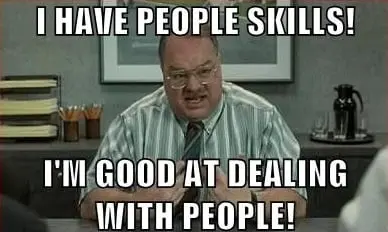

RSE is About People
********************************************************************************

The recent discussions about LLM usage in Research Software Engineering (RSE) emphasizes one important thing to me - RSE is about people.
(Really, software engineering is about people.)

As a case in point, the discussions around controlling quality of software in an era with LLM usage often seem to come around to using Software Development Lifecycle (SDLC) concepts.
The study of how software is made came out of efforts to understand and improve how humans make software in teams.
Many of the phases of SDLC, such as conceptualization, requirements analysis, acceptance, deployment, and maintenance, are focused around human communication and interaction.

When we template these SDLC activities back onto RSE activities, regardless of if a portion of the work is done with an LLM, there is still a human element.
The software we develop should match requirements for some human need.
The decision to accept the software is judged against those needs, and maintenance or extension activities are to further these needs.
We like to focus on the technical or scientific details, but ultimately the human element is what determines if our work is impactful.

Metadata
================================================================================

Started: 08 Oct 2026

Last edited: 09 Oct 2026
