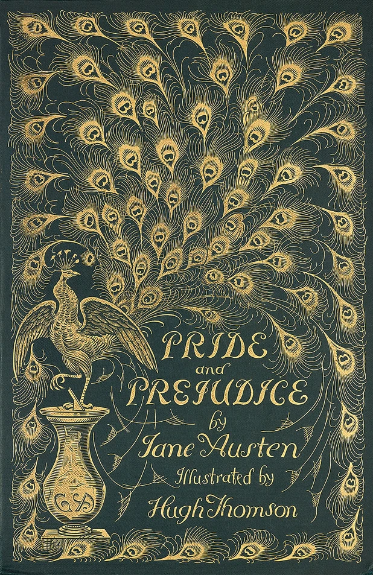

Hobbies
********************************************************************************

.. |fa-d20| raw:: html

    <i class="fa-fw fas fa-dice-d20"></i>

.. |fa-mech| raw:: html

    <i class="fa-fw fa-solid fa-robot"></i>

.. |fa-book| raw:: html

    <i class="fa-fw fa-solid fa-book"></i>

BattleTech
--------------------------------------------------------------------------------

I enjoy playing BattleTech and run events as part of `Colorado BattleTech <https://coloradobt.org>`_.
See the `Colorado BattleTech <https://coloradobt.org>`_ website to find BattleTech players in Colorado.
I also help moderate the `Catalyst Game Labs Discord <https://discord.com/invite/catalystgamelabs>`_ community.

.. figure:: img/BattleTechOutworldsWastesLogo.webp
    :alt: BattleTech Outworlds Wastes logo
    :width: 250px

I've developed a lightweight narrative league and event framework with simplified logistics rules, BattleTech: Outworlds Wastes.

| |fa-mech| `BattleTech: Outworlds Wastes <https://outworlds-wastes.jeremylt.org>`_: lightweight narrative league and event framework

Mercenary's Pride is a fun project retelling Jane Austin's Pride and Prejudice as a series of BattleTech scenarios and comm logs.

| |fa-book| `Mercenary's Pride <https://mercenarys-pride.jeremylt.org/>`_: retelling Pride and Prejudice in BattleTech

Mercenary's Pride is a fun project retelling Jane Austin's Pride and Prejudice as a series of BattleTech scenarios and comm logs.

| |fa-mech| `Skirmishers <https://skirmishers.jeremylt.org/>`_: rebuilding and expanding BattleTroops

Skirmishers is an effort to rebuild a game system like the old `BattleTroops <https://www.sarna.net/wiki/BattleTroops>`_ game from FASA.
We are attempting to overhaul and streamline the rules while expanding them to cover additional weapons and units.

Dungeons & Dragons
--------------------------------------------------------------------------------

The lore for my home D&D games can be found here:

| |fa-d20| `Theaceae <https://theaceae.jeremylt.org/>`_:    the land of tea, treasure, and adventure
| |fa-d20| `Astral Sea <https://astralsea.jeremylt.org/>`_: the realm between realms, full of intrigue and mystery
