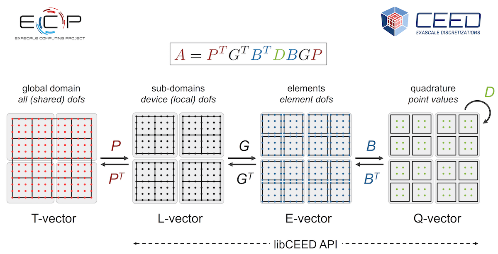
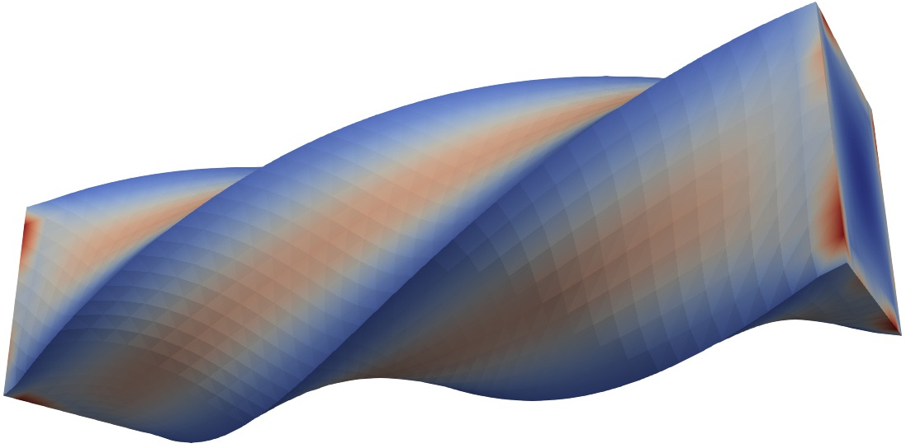
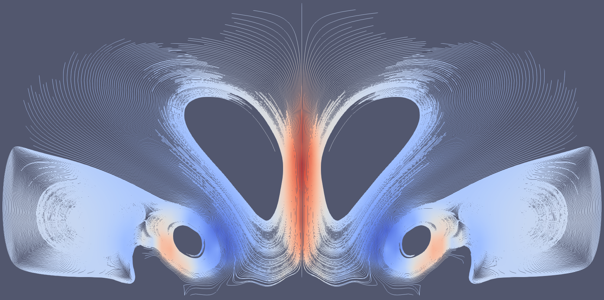

====================================
Jeremy Luke Thompson
====================================

Contact
====================================

| jeremy (at) jeremylt.org
| GitHub: `jeremylt <https://www.github.com/jeremylt>`_
| GitLab: `jeremylt <https://www.gitlab.com/jeremylt>`_
| Linkedin: `jeremylt <https://www.linkedin.com/in/jeremylt/>`_
| freeCodeCamp: `jeremylt <https://forum.freecodecamp.org/u/jeremylt/summary>`_
| ORCiD: `0000-0003-2980-0899 <https://orcid.org/0000-0003-2980-0899>`_
| ResearchGate: `Jeremy Thompson <https://www.researchgate.net/profile/Jeremy-Thompson>`_

Background
====================================

I am a computational scientist, research software engineer, and programming and mathematics educator.
My experience includes statistical analysis for the U.S. Air Force and performance portable software development as part of the Department of Energy Center for Efficient Exascale Discretizations.
I have professional experience in C, Rust, Python, C++, CUDA, Julia, Fortran, and R, as well as experience teaching several other languages.
I have taught at the U.S. Air Force Academy, University of Colorado Boulder, and online at freeCodeCamp.

Software
====================================

| `libCEED <https://www.github.com/CEED/libCEED>`_: fast algebra for efficient extensible discretizations with performance portability, run-time flexibility, and clean embedding in higher level libraries and applications

| `LFAToolkit.jl <https://www.github.com/jeremylt/LFAToolkit.jl>`_: Local Fourier Analysis of preconditioners for arbitrary, user provided weak forms of PDEs

Dungeons & Dragons
====================================

| `Theaceae <https://eudicods.github.io/Theaceae/>`_ Campaign Setting: the land of tea, treasure, and adventure
| `Astral Sea <https://eudicods.github.io/AstralSea/>`_ Campaign Setting: the realm between realms, full of intrigue and mystery