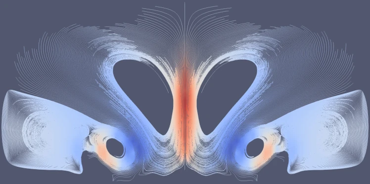
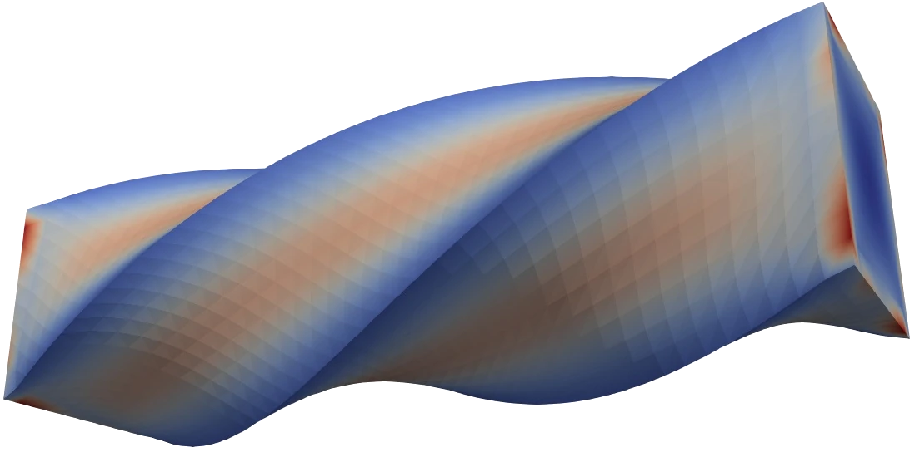
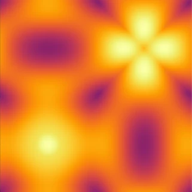

################################################################################
|icon| Jeremy L Thompson
################################################################################

.. |fa-email| raw:: html

    <i class="fa-fw fas fa-envelope"></i>

.. |fa-github| raw:: html

    <i class="fa-fw fab fa-github"></i>

.. |fa-gitlab| raw:: html

    <i class="fa-fw fab fa-gitlab"></i>

.. |fa-linked| raw:: html

    <i class="fa-fw fab fa-linkedin"></i>

.. |fa-fcc| raw:: html

    <i class="fa-fw fab fa-free-code-camp"></i>

.. |fa-orcid| raw:: html

    <i class="fa-fw fab fa-orcid"></i>

.. |fa-research| raw:: html

    <i class="fa-fw fab fa-researchgate"></i>

.. |fa-d20| raw:: html

    <i class="fa-fw fas fa-dice-d20"></i>

.. |fa-mech| raw:: html

    <i class="fa-fw fa-solid fa-robot"></i>

.. |fa-rust| raw:: html

    <i class="fa-fw fab fa-rust"></i>

.. |fa-mastadon| raw:: html

    <i class="fa-fw fab fa-mastodon"></i>

.. |fa-discord| raw:: html

    <i class="fa-fw fa-brands fa-discord"></i>

Contact
********************************************************************************

| |fa-github|   GitHub:        `jeremylt <https://www.github.com/jeremylt>`_
| |fa-gitlab|   GitLab:        `jeremylt <https://www.gitlab.com/jeremylt>`_
| |fa-linked|   Linkedin:      `jeremylt <https://www.linkedin.com/in/jeremylt/>`_
| |fa-fcc|      freeCodeCamp:  `jeremylt <https://forum.freecodecamp.org/u/jeremylt/summary>`_
| |fa-orcid|    ORCiD:         `0000-0003-2980-0899 <https://orcid.org/0000-0003-2980-0899>`_
| |fa-research| ResearchGate:  `Jeremy Thompson <https://www.researchgate.net/profile/Jeremy-Thompson>`_
| |fa-email|    email:          jeremy (at) jeremylt.org

Background
********************************************************************************

I am a research software engineer, applied mathematician, and STEM educator.
My experience includes `performance portable software development <https://ceed.exascaleproject.org/>`_ for `physics based simulations <https://micromorph.gitlab.io/>`_ on exascale hardware as part of centers funded by grants from the Department of Energy and statistical analysis for the `U.S. Air Force <https://en.wikipedia.org/wiki/49th_Test_and_Evaluation_Squadron>`_.
I have professional experience in C, Rust, Python, C++, CUDA, Julia, Fortran, and R, among other languages.
I have taught at the `U.S. Air Force Academy <https://www.usafa.edu/department/mathematics/>`_ and `University of Colorado at Boulder <https://www.colorado.edu/amath/>`_, and I am a mentor online at `freeCodeCamp <https://www.freecodecamp.org/>`_.

Software
********************************************************************************

`libCEED <https://www.github.com/CEED/libCEED>`_
--------------------------------------------------------------------------------

libCEED provides fast algebra for element-based discretizations, designed for performance portability, run-time flexibility, and clean embedding in higher level libraries and applications. It offers a C99 interface as well as bindings for Fortran, `Python <https://pypi.org/project/libceed/>`_, `Julia <https://juliapackages.com/p/libceed>`_ , and `Rust <https://lib.rs/crates/libceed>`_.
While our focus is on high-order finite elements, the approach is mostly algebraic and thus applicable to other discretizations in factored form.

    Fluid dynamics example of vortices from falling cold air bubble.

`Ratel <https://gitlab.com/micromorph/ratel>`_
--------------------------------------------------------------------------------

Ratel provides solid mechanics solvers based on `libCEED <https://www.github.com/CEED/libCEED>`_ and `PETSc <https://petsc.org>`_.
While the current library focuses on hyperelastic formulations, with ongoing work in quasistatic and fully dynamic examples, the long term goal of this project is to implement the material point method in a matrix free fashion.

    Solid mechanics example of beam deforming under twisting force.

`LFAToolkit.jl <https://www.github.com/jeremylt/LFAToolkit.jl>`_
--------------------------------------------------------------------------------

Local Fourier Analysis is a tool commonly used in the analysis of multigrid and multilevel algorithms for solving partial differential equations via finite element or finite difference methods.
This analysis can be used to predict convergence rates and optimize parameters in multilevel methods and preconditioners.
This package provides a toolkit for analyzing the performance of preconditioners for arbitrary, user provided weak forms of partial differential equations.

    Local Fourier Analysis of p-multigrid for high-order finite element.

Publications and Presentations
********************************************************************************

A list of my publications can be found on `ORCiD <https://orcid.org/0000-0003-2980-0899>`_ and `ResearchGate <https://www.researchgate.net/profile/Jeremy-Thompson>`_.
The source and PDFs of my presentations can be found on `GitHub <https://github.com/jeremylt/Presentations>`_.

Social Media
********************************************************************************

.. |mastadon-link| raw:: html

    <a class="reference external" rel="me" href="https://social.freecodecamp.org/@jeremylt">Mastodon</a>

| |fa-discord|  `Discord <https://discordapp.com/users/513148167923957761>`_
| |fa-mastadon| |mastadon-link|

Hobbies
********************************************************************************

BattleTech
--------------------------------------------------------------------------------

| |fa-mech| `Outworlds Wastes <https://outworlds-wastes.jeremylt.org>`_:    casual league framework

Dungeons & Dragons
--------------------------------------------------------------------------------

| |fa-d20| `Theaceae <https://theaceae.jeremylt.org/>`_:    the land of tea, treasure, and adventure
| |fa-d20| `Astral Sea <https://astralsea.jeremylt.org/>`_: the realm between realms, full of intrigue and mystery

Advent of Code
--------------------------------------------------------------------------------

| |fa-rust| `2020 <https://www.github.com/jeremylt/advent2020>`_: Plane, train, boat
